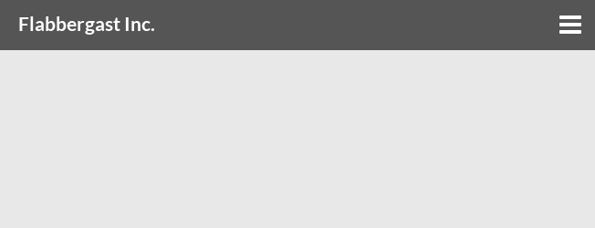

# Impromptu React Animated Header

A responsive nav header component for React.



Try before you browserify: http://laserpants.github.io/impromptu-react-animated-header/

## Installation

Npm is the recommended install method.

```bash
$ npm install impromptu-react-animated-header
```

Copy CSS files and icons to a suitable location. 

```bash
$ cp -r node_modules/impromptu-react-animated-header/css/ node_modules/impromptu-react-animated-header/icons/ .
```

## How to use

* Include the module.

```
var TopMenu   = require('impromptu-react-animated-header').TopMenu;
var MenuItem  = require('impromptu-react-animated-header').MenuItem;
var MenuBrand = require('impromptu-react-animated-header').MenuBrand;
```

* Lay out the menu using the `<TopMenu>` and `<MenuItem>` components. An optional `<MenuBrand>` can be included prior to the menu items.

```
<TopMenu>
    <MenuBrand>
        <a href="#home">Navigation</a>
    </MenuBrand>
    <MenuItem>
        <a href="#home">Home</a>
    </MenuItem>
    <MenuItem>
        <a href="#about">About</a>
    </MenuItem>
    <MenuItem>
        <a href="#configuration">Configuration</a>
    </MenuItem>
    <MenuItem>
        <a href="#contribute">Contribute</a>
    </MenuItem>
 </TopMenu>
```

#### Full working example

In this example, we create the menu component in `main.js`.

```javascript
var React     = require('react');
var TopMenu   = require('impromptu-react-animated-header').TopMenu;
var MenuItem  = require('impromptu-react-animated-header').MenuItem;
var MenuBrand = require('impromptu-react-animated-header').MenuBrand;

var MyMenu = React.createClass({
    render: function() {
        return (
            <TopMenu>
                <MenuBrand>
                    <a href="#home">Navigation</a>
                </MenuBrand>
                <MenuItem>
                    <a href="#home">Home</a>
                </MenuItem>
                <MenuItem>
                    <a href="#about">About</a>
                </MenuItem>
                <MenuItem>
                    <a href="#configuration">Configuration</a>
                </MenuItem>
                <MenuItem>
                    <a href="#contribute">Contribute</a>
                </MenuItem>
             </TopMenu>
        );
    }
});

React.render(
    <MyMenu />,
    document.getElementById('anchor')
);
```

Make sure `index.html` includes `impromptu-header.min.css`.

```html
<!DOCTYPE html>
<html lang="en">
<head>
    <meta charset="utf-8">
    <meta http-equiv="X-UA-Compatible" content="IE=edge">
    <meta name="viewport" content="width=device-width, initial-scale=1">
    <title>React Impromptu Animated Header</title>
    <link href="css/impromptu-header.min.css" rel="stylesheet">
</head>
<body>
    <div id="anchor"></div>
    <script src="bundle.js"></script>
</body>
</html>
```

Build the example, e.g., using Browserify:

```bash
$ browserify -t reactify main.js -o bundle.js 
```

## Styling

The included stylesheet is pretty rudimentary. Typically, you'd want to, at least, override the default font and align the colors with the rest of your application.

```html
<link href="//cdnjs.cloudflare.com/ajax/libs/meyer-reset/2.0/reset.min.css" rel="stylesheet">
<link href="css/impromptu-header.min.css" rel="stylesheet">
<link href="//fonts.googleapis.com/css?family=Lato:300,400,700,900" rel="stylesheet">
<style type="text/css" rel="stylesheet">
    body { 
        font-family: "Lato", sans-serif; 
    }
    header {
        background-color: #4eb1ba;         /* Nav background color */
    }
    .nav-collapse.nav-compact a {
        background-color: #3ea1aa;         /* Background of drop-down in collapsed mode */
    }
    .nav-collapse.nav-full ul, 
    .nav-collapse.nav-full a {
        border-color: #5ec1ca !important;  /* Divider lines */
    }
    .nav-collapse.nav-compact a {
        border-color: #4eb1ba !important;  /* Horizontal divider in collapsed menu */
    }
    .nav-collapse a:active,
    .nav-collapse .active a {
        background-color: #5ec1ca;         /* Active state background color */
    }
</style>
```

The examples include a more complete [themed version](http://laserpants.github.io/impromptu-react-animated-header/public/themed.html) of the navbar, using the [theme.css](https://github.com/laserpants/impromptu-react-animated-header/blob/master/public/css/theme.css) stylesheet.

## Props

`TopMenu` supports a number of props:

| Property         | Type                     | Description   | Default      | 
| ---------------- | ------------------------ | ------------- | ------------ |
| `align`          | 'left'&nbsp;&vert;&nbsp;'right'         | Horizontal alignment of the menu. | 'left'
| `brandAlign`     | 'left'&nbsp;&vert;&nbsp;'right'         | Position of the logo, if one is used. | 'left'
| `autoClose`      | Boolean                  | Controls whether the menu should automatically close when an item is clicked.      | true      |
| `threshold`      |  Number                  | Collapse breakpoint: A viewport width less than this value will cause the navbar to collapse (in pixels). | 769    |
| `cssTransitions` |  Boolean                 | Apply CSS classes for transitions? (See [examples](http://laserpants.github.io/impromptu-react-animated-header/public/default.html)) | false  |
| `animate`        |  Boolean                 | Animate opening and closing of the menu in collapsed mode? | true   |
| `duration`       |  Number                  | Duration of the anmation, in milliseconds. | 300    |

## Contribute

Fork, submit pull requests or report any issues: https://github.com/laserpants/impromptu-react-animated-header

## License

Impromptu React Animated Header is provided under the BSD License.
